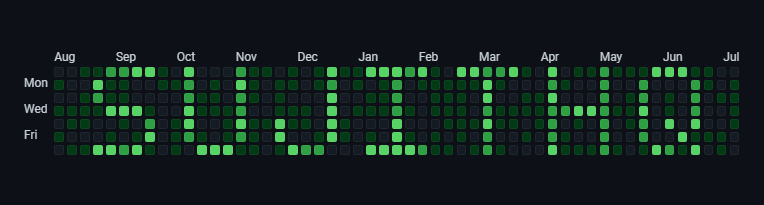

<!-- Banner -->
<!-- markdownlint-disable MD041 -->

# 👋 Hi, I'm Sujith Quintelier  

🚀 Azure Architect • Dev(Sec)Ops Engineer • GitHub Accredited Trainer • Terraform Enthusiast  

---

## 🌟 About Me

I help teams succeed with **Azure, DevOps, GitHub, and recently Platform Engineering** — from design to delivery.  
Currently working on:  

- ✍️ [Blog](https://quintelier.dev) blog series  
- 🛠️ Building GitHub + Azure training content  
- ⚡ Exploring AI, Platform Engineering & MCP  

---

## 🔗 Connect with Me

---

## ✨ Highlights

- 📖 Blog: [quintelier.dev](https://quintelier.dev)
- Azure Certified
  - Azure Cloud Solutions & Cybersecurity Architect
  - Azure (Identity and Access) Administrator
  - Azure DevOps, AI, Security & Network Engineer
  - Azure (Cosmos DB) Developer
- 🎓 GitHub Accredited Trainer
  - GitHub Actions
  - GitHub for Developers
  - GitHub Administration
  - GitHub Advanced Security Gettings Started training
  - GitHub Migrations
  - GitHub Enterprise Importer
  - Github Copilot for Business Fundamentals
- 📦 Terraform Associate
- 🛠️ Platform Engineering
  - Practitioner  
<!-- - 🛠️ Projects:  
  - [Battleship in C#](#) 🎮  
  - [AKS Hardening with Terraform](#) 🔐  
  - [Morse Commit Notifier](#) 🔔   -->

---

## 📊 GitHub Stats

---

## Latest Posts

### 📝Blog
<!-- BLOG-POST-LIST:START -->
* [Mastering Asynchronous Programming with C# async/await - Part 3: Common Pitfalls and Best Practices](https://quintelier.dev/posts/2025/10/csharp-async-await-part3/)
* [🤖 Automating Dependabot at Scale: GitHub Actions Strategy](https://quintelier.dev/posts/2025/09/automating-dependabot-at-scale-github-actions-strategy/)
* [Mastering Asynchronous Programming with C# async/await - Part 2: Deep Dive](https://quintelier.dev/posts/2025/09/csharp-async-await-part2/)
* [🤖 When to Use GitHub Models, Azure AI Foundry, and OpenAI](https://quintelier.dev/posts/2025/09/when-to-use-github-models-azure-ai-foundry-openai/)
* [Mastering Asynchronous Programming with C# async/await](https://quintelier.dev/posts/2025/09/csharp-async-await/)
* [Mastering Asynchronous Programming with C# async/await - Part 1: Introduction](https://quintelier.dev/posts/2025/09/csharp-async-await-part1/)
* [Taming Dependabot: Bundle NuGet, npm, and GitHub Actions Updates Without Merge Conflicts](https://quintelier.dev/posts/2025/09/taming-dependabot-bundle-nuget-npm-github-actions-updates-without-merge-conflicts/)
* [🤖 GitHub Copilot Certification Guide (GH-300) - AI Development Mastery](https://quintelier.dev/posts/2025/08/github-certification-journey-gh-300/)
* [Getting started with Dependabot](https://quintelier.dev/posts/2025/08/dependabot-getting-started/)
* [Platform Engineering Course Guide 🚀](https://quintelier.dev/posts/2025/08/platform-engineering-certified-practitioner/)
<!-- BLOG-POST-LIST:END -->
### 🔃 Latest Updates

<!-- UPDATES-LIST:START -->
* [terraform: 5 tips for credential management across multi-cloud](https://quintelier.dev/updates/5-tips-for-credential-management-across-multi-cloud/)
* [github: Start your new repository with Copilot coding agent](https://quintelier.dev/updates/start-your-new-repository-with-copilot-coding-agent/)
* [azure: [In preview] Public Preview: Soft Delete feature in Azure Compute Gallery](https://quintelier.dev/updates/in-preview-public-preview-soft-delete-feature-in-azure-compute-gallery/)
* [security: Empowering defenders in the era of agentic AI with Microsoft Sentinel](https://quintelier.dev/updates/empowering-defenders-in-the-era-of-agentic-ai-with-microsoft-sentinel/)
* [dotnet: Preparing Your .NET MAUI Apps for Google Play’s 16 KB Page Size Requirement](https://quintelier.dev/updates/preparing-your-net-maui-apps-for-google-play-s-16-kb-page-size-requirement/)
* [ai: Foundry Local Meets More Silicon](https://quintelier.dev/updates/foundry-local-meets-more-silicon/)
<!-- UPDATES-LIST:END -->

#### (Auto-updated via GitHub Action)

---

## 🏆 Certifications

I hold multiple certifications across **Azure, GitHub, Terraform, Platform Engineering, Security, and AI**.  
  

👉 Full certification wall below 👇

---

### 🛠️ Platform Engineering

---

### ☁️ Microsoft Certifications

#### Fundamentals

- Azure  
- Azure AI  

#### Applied Skills

- [Deploy containers by using Azure Kubernetes Service](https://learn.microsoft.com/api/credentials/share/en-us/SujithQuintelier/318752898E087DD5?sharingId=B2D5696D597C46D3)
- [Configure secure access to your workloads using Azure networking](https://learn.microsoft.com/api/credentials/share/en-us/SujithQuintelier/D2A5F7C1E7A3804B?sharingId=B2D5696D597C46D3)
- [Develop an ASP.NET Core web app that consumes an API](https://learn.microsoft.com/api/credentials/share/en-us/SujithQuintelier/24CCA82D9F5E4E74?sharingId=B2D5696D597C46D3)
- [Secure storage for Azure Files and Azure Blob Storage](https://learn.microsoft.com/api/credentials/share/en-us/SujithQuintelier/B8BA947FCE07FE20?sharingId=B2D5696D597C46D3)
- [Deploy and configure Azure Monitor](https://learn.microsoft.com/api/credentials/share/en-us/SujithQuintelier/DD793FB62E19C2AA?sharingId=B2D5696D597C46D3)
- [Create an intelligent document processing solution with Azure AI Document Intelligence](https://learn.microsoft.com/api/credentials/share/en-us/SujithQuintelier/B8BA947FCE07FE20?sharingId=B2D5696D597C46D3)
- [Build a natural language processing solution with Azure AI Language](https://learn.microsoft.com/api/credentials/share/en-us/SujithQuintelier/B8BA947FCE07FE20?sharingId=B2D5696D597C46D3)
- [Build an Azure AI Vision solution](https://learn.microsoft.com/api/credentials/share/en-us/SujithQuintelier/78424700D5CCDF7?sharingId=B2D5696D597C46D3)
- [Implement security through a pipeline using Azure DevOps](https://learn.microsoft.com/api/credentials/share/en-us/SujithQ/8EBF6803F8A567C0?sharingId=7E02E186AF4FAF6D)
- [Deploy cloud-native apps using Azure Container Apps](https://learn.microsoft.com/api/credentials/share/en-us/SujithQuintelier/52634899052A0752?sharingId=B2D5696D597C46D3)
- [Migrate SQL Server workloads to Azure SQL Database](https://learn.microsoft.com/api/credentials/share/en-us/SujithQuintelier/BAFE8995F6D16FE0?sharingId=B2D5696D597C46D3)
- [Accelerate app development by using GitHub Copilot](https://learn.microsoft.com/api/credentials/share/en-us/SujithQuintelier/DE9C2B2AEE86809B?sharingId=B2D5696D597C46D3)

---

### 🐙 GitHub Certifications

---

### 🏆 GitHub Accreditations

---

### 📑 GitHub Certificate of Completion

---

### 🌍 Terraform

---

### 🔐 securiti.ai

---

### 📘 Microsoft Learn

---

### 🥋 Security Journey

---

### ☁️ Cloud Champion

---

### 🔎 Azure Data Explorer

---

### 📊 Must Learn KQL

---

### ☁️ AWS

---

## 🧑‍💻 Skills

;Infrastructure+as+Code+(Terraform%2C+Bicep%2C+Pulumi);Identity+%26+Access+Management;Networking+%26+Zero+Trust;Application+Development+.NET+%26+C%23;Programming+(Python%2C+Go);Data+(Cosmos+DB%2C+KQL);AI+%26+Cognitive+Services;Trainer+(Azure+%26+GitHub))

---

## 🐍 Contribution Snake

<picture>
  <source media="(prefers-color-scheme: dark)" srcset="https://raw.githubusercontent.com/sujithq/sujithq/output/github-contribution-grid-snake-dark.svg" />
  <source media="(prefers-color-scheme: light)" srcset="https://raw.githubusercontent.com/sujithq/sujithq/output/github-contribution-grid-snake.svg" />
  

</picture>

---

⚡ Bridging Dev(Sec)Ops, Azure, and GitHub — one pipeline at a time ⚡
